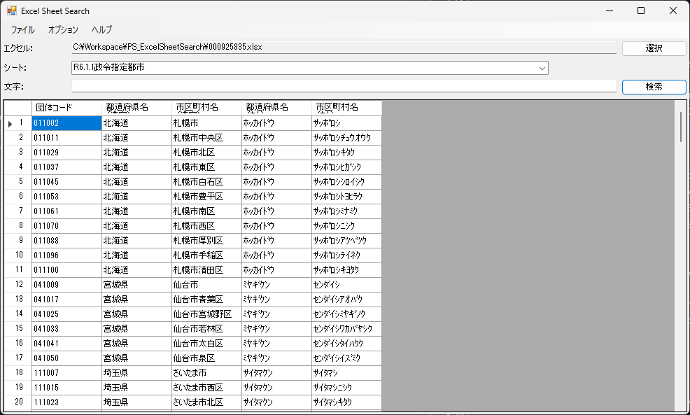

# PSExcelSheetSearch

## エクセルシートを文字検索するアプリです。

	- 文字の欄に入力した単語が含まれる行だけを検索して表示します。
	- 読み込むエクセルシートは１行目がヘッダー行になるようにしてください。
	- ライブラリとして ImportExcel を使用しますのでインストールするか、同一フォルダにおいて config.json で設定して読むこむようにしてください。

## 画面

## 既知の不具合

	- Version 0.2  ( 2024-11-26 リリース)
		-  ExcelをComObjectから使うと遅いと確認。一旦 ComObjectは非推奨とする。

	- Version 0.1  ( 2024-11-25 リリース)
		-  ImportExcel の読み込める件数に限界があり、大量データの場合に読む込でフリーズします。
		-  Microsoft 365 で Excel ComObjecr にアクセスできない場合がありましたので、ImportExcel の利用を前提にしています。
		-  ExcelをComObjectで使うかどうかはオプションメニューから選択できるようにしています。（未検証）
